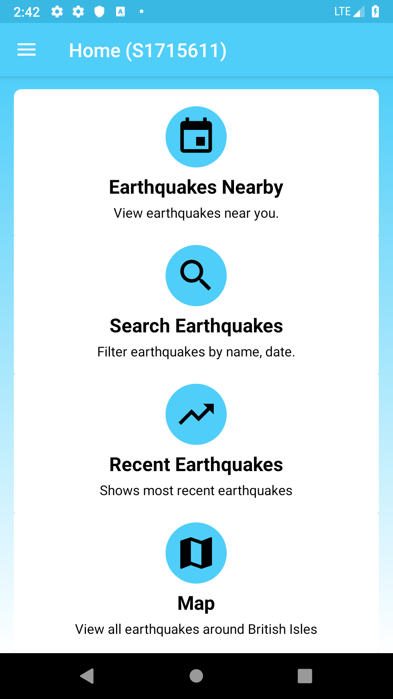

# Mobile Platform Development Coursework

This repo is for the coursework section of the MPD module. In the coursework we were tasked with creating a mobile app that pulls data from [BGS](http://earthquakes.bgs.ac.uk/feeds/MhSeismology.xml)'s XML/RSS feed and displaying the information in an appropriate manner for a mobile application. 

### The app should:

* Include landscape support
* Use threads to retrieve information at regular intervals
* Provide various ways to search or filter seismic events

Student ID - S1715611
